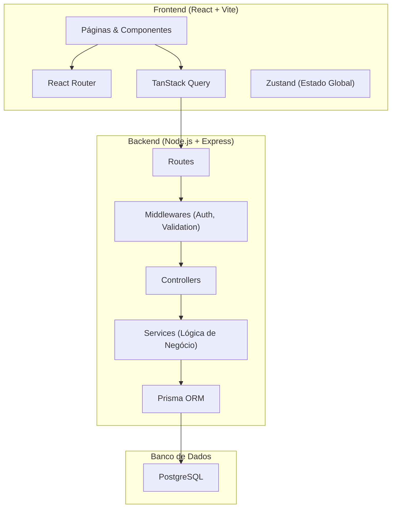
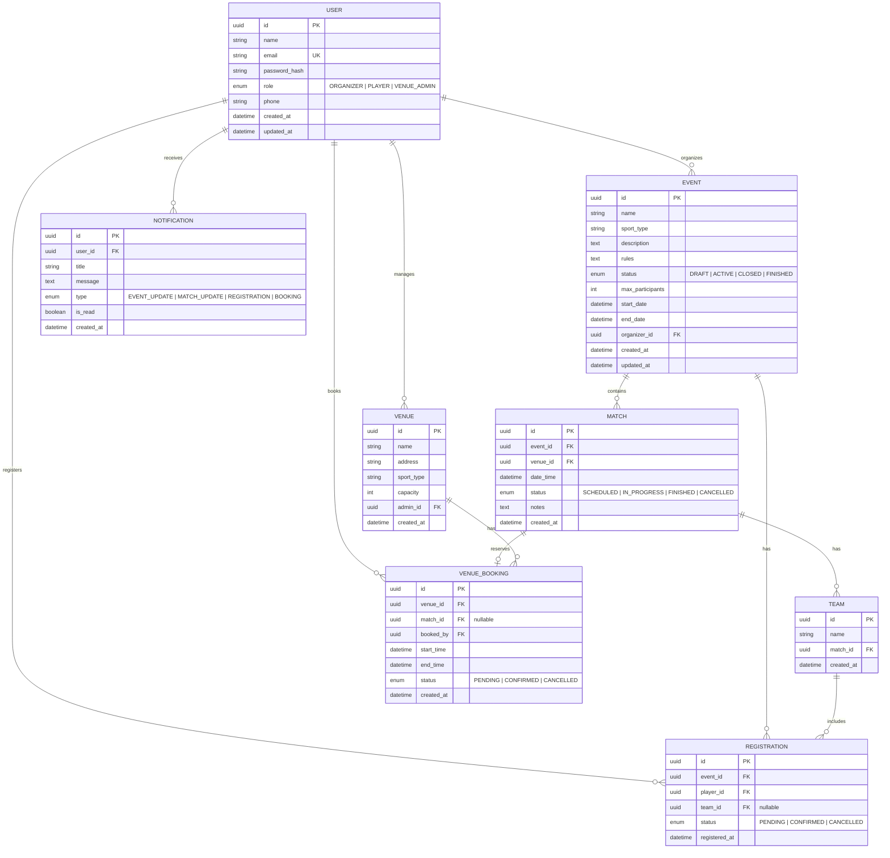

# SportHub — Plano de Implementação

Plataforma web de gestão integrada de eventos esportivos amadores, conectando **Organizadores**, **Jogadores** e **Administradores de Locais**.

---

## Revisão do Usuário Necessária

> [!IMPORTANT]
> **Discrepância na Stack do Backend:** Os documentos apresentam uma inconsistência:
> - O **TAP** e a **AVP** mencionam `PHP/Laravel` como backend.
> - A seção de **Requisitos Não-Funcionais (NF001 - Conformidade Tecnológica)** especifica `JavaScript/Node.js`.
>
> **Este plano segue a especificação dos requisitos (Node.js)**, que é o documento mais normativo. Favor confirmar se isso está correto ou se o backend deve ser em Laravel.

> [!WARNING]
> **Redis:** A AVP menciona Redis. Neste plano, ele **não será incluído** na primeira versão — as notificações serão implementadas via polling/SSE simples. Se necessário, Redis pode ser adicionado posteriormente para pub/sub e caching. Confirme se há requisito específico para Redis.

## Questões em Aberto

1. **Tipos de esportes suportados inicialmente?** (futebol, futsal, vôlei, basquete, etc.) — Isso influencia a modelagem de partidas e regras.
2. **Há requisito de notificação em tempo real (WebSocket)?** Ou notificações exibidas ao acessar a plataforma são suficientes?
3. **O "Administrador de Local" é um tipo de usuário separado?** Ou o mesmo organizador pode também gerenciar locais?
4. **Há necessidade de painel administrativo geral** (super-admin da plataforma)?
5. **Qual o padrão de commits/branching desejado?** (Conventional Commits + Git Flow?)

---

## Arquitetura Geral



### Stack Tecnológica

| Camada | Tecnologia | Justificativa |
|--------|-----------|---------------|
| **Frontend** | React 19 + Vite + TypeScript | Performance, DX moderno, tipagem forte |
| **Roteamento** | React Router v7 | SPA com roteamento declarativo |
| **Estado Global** | Zustand | Leve, simples, sem boilerplate |
| **Data Fetching** | TanStack Query (React Query) | Cache, sync, refetch automático |
| **Validação** | Zod | Validação com inferência de tipos |
| **Backend** | Node.js + Express + TypeScript | Requisito NF001 |
| **ORM** | Prisma | Schema-first, type-safe, ótimo DX |
| **Banco de Dados** | PostgreSQL 16 | Requisito do projeto |
| **Autenticação** | JWT (Access + Refresh Tokens) + bcrypt | Requisito NF001-Segurança |
| **Segurança** | Helmet, CORS, Rate Limiting | Boas práticas |
| **Testes** | Vitest (front) + Jest (back) | Cobertura end-to-end |

---

## Estrutura do Projeto (Monorepo Simplificado)

```
sporthub/
├── client/                          # Frontend React + Vite
│   ├── public/
│   ├── src/
│   │   ├── assets/                  # Imagens, ícones, fontes
│   │   ├── components/              # Componentes reutilizáveis
│   │   │   ├── ui/                  # Button, Input, Card, Modal...
│   │   │   ├── layout/              # Header, Sidebar, Footer
│   │   │   └── shared/              # Componentes compartilhados
│   │   ├── features/                # Módulos por funcionalidade
│   │   │   ├── auth/                # Login, Registro, contexto auth
│   │   │   ├── events/              # Listagem, criação, detalhe de eventos
│   │   │   ├── matches/             # Partidas, equipes
│   │   │   ├── registrations/       # Inscrições
│   │   │   ├── venues/              # Locais e reservas
│   │   │   └── notifications/       # Central de notificações
│   │   ├── hooks/                   # Custom hooks
│   │   ├── lib/                     # Utilitários, API client (axios)
│   │   ├── store/                   # Zustand stores
│   │   ├── styles/                  # CSS global, design tokens
│   │   ├── types/                   # Tipos TypeScript compartilhados
│   │   ├── App.tsx
│   │   ├── Router.tsx
│   │   └── main.tsx
│   ├── index.html
│   ├── vite.config.ts
│   ├── tsconfig.json
│   └── package.json
│
├── server/                          # Backend Node.js + Express
│   ├── prisma/
│   │   ├── schema.prisma            # Schema do banco
│   │   ├── migrations/              # Migrações
│   │   └── seed.ts                  # Dados iniciais
│   ├── src/
│   │   ├── config/                  # DB, env, constantes
│   │   ├── controllers/             # Request handlers
│   │   ├── middlewares/             # Auth, validation, error handling
│   │   ├── routes/                  # Definições de rotas
│   │   ├── services/                # Lógica de negócio
│   │   ├── utils/                   # Helpers
│   │   ├── types/                   # Tipos TypeScript
│   │   └── app.ts                   # Express setup
│   ├── tsconfig.json
│   └── package.json
│
├── .env.example                     # Template de variáveis de ambiente
├── .gitignore
├── README.md
└── package.json                     # Scripts raiz (dev, build)
```

---

## Modelagem do Banco de Dados



### Tabelas Principais

| Tabela | Descrição |
|--------|-----------|
| `User` | Usuários do sistema com roles (ORGANIZER, PLAYER, VENUE_ADMIN) |
| `Event` | Eventos esportivos criados por organizadores |
| `Match` | Partidas individuais dentro de um evento |
| `Team` | Equipes formadas para cada partida |
| `Registration` | Inscrições de jogadores em eventos |
| `Venue` | Locais esportivos (quadras, campos) |
| `VenueBooking` | Reservas de locais para partidas |
| `Notification` | Notificações para os usuários |

---

## Módulos Funcionais

### 1. Autenticação & Autorização (RF-Auth)

- **Registro** com nome, email, senha e seleção de role
- **Login** com JWT (access token 15min + refresh token 7d em httpOnly cookie)
- **RBAC Middleware**: roles `ORGANIZER`, `PLAYER`, `VENUE_ADMIN`
- **Hashing** de senhas com `bcrypt` (salt rounds = 12)

**Rotas da API:**
```
POST   /api/auth/register
POST   /api/auth/login
POST   /api/auth/refresh
POST   /api/auth/logout
GET    /api/auth/me
```

---

### 2. Módulo do Organizador — Gestão de Eventos (RF001, RF002)

#### [RF001] Cadastrar Evento e Partidas
- CRUD completo de eventos
- Criação de partidas vinculadas ao evento com data, hora e local sugerido
- Validação de conflito de horário no local sugerido
- Status do evento: DRAFT → ACTIVE → CLOSED → FINISHED

#### [RF002] Gerenciar Inscrições e Equipes
- Visualizar lista centralizada de inscritos
- Aprovar/rejeitar inscrições
- Criar equipes e alocar jogadores (drag & drop no frontend)

**Rotas da API:**
```
GET    /api/events                    # Listar eventos (filtros)
POST   /api/events                    # Criar evento
GET    /api/events/:id                # Detalhe do evento
PUT    /api/events/:id                # Atualizar evento
DELETE /api/events/:id                # Excluir evento
POST   /api/events/:id/matches        # Criar partida
GET    /api/events/:id/registrations   # Listar inscritos
PUT    /api/registrations/:id/status   # Aprovar/rejeitar inscrição
POST   /api/matches/:id/teams          # Criar equipe
PUT    /api/teams/:id/members          # Alocar jogadores
```

---

### 3. Módulo do Jogador — Participação (RF001, RF002)

#### [RF001] Inscrever-se em Evento
- Listagem de eventos ativos com filtros (esporte, data, local)
- Botão de inscrição com verificação de vagas
- Cancelamento de inscrição

#### [RF002] Visualizar Detalhes e Notificações
- Painel do jogador com eventos inscritos
- Detalhes das partidas (local, data, hora, equipe)
- Central de notificações com alertas de atualização

**Rotas da API:**
```
GET    /api/events/available           # Eventos disponíveis para inscrição
POST   /api/events/:id/register        # Inscrever-se
DELETE /api/events/:id/register        # Cancelar inscrição
GET    /api/player/dashboard           # Painel do jogador
GET    /api/player/matches             # Minhas partidas
GET    /api/notifications              # Notificações do usuário
PUT    /api/notifications/:id/read     # Marcar como lida
```

---

### 4. Módulo Admin de Local — Reservas

- CRUD de locais esportivos (quadras, campos)
- Calendário visual de reservas
- Aprovação/rejeição de solicitações de reserva
- Detecção automática de conflitos de horário

**Rotas da API:**
```
GET    /api/venues                     # Listar locais
POST   /api/venues                     # Cadastrar local
GET    /api/venues/:id                 # Detalhe do local
PUT    /api/venues/:id                 # Atualizar local
GET    /api/venues/:id/bookings        # Agenda de reservas
POST   /api/venues/:id/bookings        # Solicitar reserva
PUT    /api/bookings/:id/status        # Aprovar/rejeitar reserva
```

---

## Design System & UI

### Princípios de Design
- **Dark mode** como padrão com opção de light mode
- **Glassmorphism** em cards e modais
- **Bento grid layout** para dashboards
- **Micro-animações** com Framer Motion
- **Tipografia moderna**: Inter (Google Fonts)
- **Design responsivo** (mobile-first)

### Paleta de Cores (Dark Mode)

| Token | Valor | Uso |
|-------|-------|-----|
| `--bg-primary` | `hsl(225, 25%, 8%)` | Fundo principal |
| `--bg-secondary` | `hsl(225, 20%, 12%)` | Cards, painéis |
| `--bg-tertiary` | `hsl(225, 18%, 16%)` | Inputs, hovers |
| `--accent-primary` | `hsl(145, 65%, 45%)` | Verde esportivo — CTAs |
| `--accent-secondary` | `hsl(200, 80%, 55%)` | Azul — links, info |
| `--accent-warning` | `hsl(35, 90%, 55%)` | Laranja — avisos |
| `--accent-danger` | `hsl(0, 70%, 55%)` | Vermelho — erros, cancelar |
| `--text-primary` | `hsl(0, 0%, 95%)` | Texto principal |
| `--text-secondary` | `hsl(0, 0%, 65%)` | Texto secundário |
| `--glass-bg` | `rgba(255,255,255,0.05)` | Glassmorphism background |
| `--glass-border` | `rgba(255,255,255,0.1)` | Glassmorphism border |

### Páginas Principais

1. **Landing Page** — Apresentação do SportHub com CTA de registro
2. **Login / Registro** — Formulários com validação visual
3. **Dashboard do Organizador** — Bento grid com eventos, partidas, inscrições
4. **Dashboard do Jogador** — Eventos inscritos, próximas partidas, notificações
5. **Dashboard do Admin de Local** — Calendário de reservas, locais
6. **Listagem de Eventos** — Cards com filtros e busca
7. **Detalhe do Evento** — Info completa, partidas, inscrição
8. **Gestão de Equipes** — Interface drag & drop para alocar jogadores
9. **Perfil do Usuário** — Dados pessoais e configurações

---

## Fases de Desenvolvimento

### Fase 1 — Fundação (Sprint 1)
- [x] Inicializar monorepo com `client/` e `server/`
- [ ] Configurar Vite + React + TypeScript no client
- [ ] Configurar Express + TypeScript no server
- [ ] Configurar Prisma + PostgreSQL
- [ ] Definir schema do banco e rodar migrations
- [ ] Criar seed com dados iniciais
- [ ] Design system (CSS global, tokens, componentes base)
- [ ] Configurar Git + `.gitignore` + README

### Fase 2 — Autenticação & Layout (Sprint 2)
- [ ] Implementar registro e login no backend (JWT + bcrypt)
- [ ] Middleware de autenticação e autorização (RBAC)
- [ ] Telas de login e registro no frontend
- [ ] Layout base (Header, Sidebar, proteção de rotas)
- [ ] Contexto de autenticação (Zustand + React Query)

### Fase 3 — Módulo do Organizador (Sprint 3)
- [ ] CRUD de eventos (backend + frontend)
- [ ] Criação de partidas dentro de eventos
- [ ] Gestão de inscrições (listagem, aprovação)
- [ ] Criação de equipes e alocação de jogadores
- [ ] Validação de conflitos de horário

### Fase 4 — Módulo do Jogador & Notificações (Sprint 4)
- [ ] Listagem de eventos disponíveis com filtros
- [ ] Inscrição/cancelamento em eventos
- [ ] Dashboard do jogador
- [ ] Sistema de notificações (backend + frontend)
- [ ] Detalhes das partidas e equipes

### Fase 5 — Módulo de Locais & Polish (Sprint 5)
- [ ] CRUD de locais esportivos
- [ ] Sistema de reservas com detecção de conflitos
- [ ] Calendário visual de reservas
- [ ] Landing page
- [ ] Responsividade e ajustes finais
- [ ] Testes e documentação

---

## Alterações Propostas

### Inicialização do Projeto

#### [NEW] `sporthub/package.json`
Package.json raiz com scripts para rodar client e server simultaneamente via `concurrently`.

#### [NEW] `sporthub/client/` (Vite + React + TypeScript)
Projeto React inicializado com `create-vite` template `react-ts`.

#### [NEW] `sporthub/server/` (Express + TypeScript)
Projeto Node.js com Express, configurado com TypeScript, Prisma e estrutura de pastas (controllers, services, middlewares, routes).

#### [NEW] `sporthub/server/prisma/schema.prisma`
Schema Prisma com todos os modelos: User, Event, Match, Team, Registration, Venue, VenueBooking, Notification.

#### [NEW] `sporthub/client/src/styles/index.css`
Design system completo com CSS custom properties, dark mode, glassmorphism, tipografia Inter.

#### [NEW] `sporthub/client/src/components/ui/`
Componentes base reutilizáveis: Button, Input, Card, Modal, Badge, Avatar.

#### [NEW] `sporthub/.gitignore`
Ignorar node_modules, .env, dist, .prisma, etc.

#### [NEW] `sporthub/.env.example`
Template com variáveis necessárias: DATABASE_URL, JWT_SECRET, PORT, etc.

#### [NEW] `sporthub/README.md`
Documentação do projeto com instruções de setup, arquitetura e tecnologias.

---

## Plano de Verificação

### Testes Automatizados
- **Backend**: Testes unitários dos services com Jest
- **Backend**: Testes de integração das rotas da API com Supertest
- **Frontend**: Testes de componentes com Vitest + Testing Library
- **Comando**: `npm run test` (raiz executa ambos)

### Verificação Manual
- Testar fluxo completo de registro → login → criar evento → inscrever jogador
- Verificar RBAC (jogador não pode criar evento, organizador não pode gerenciar locais)
- Testar conflitos de horário em reservas
- Verificar responsividade em mobile/tablet/desktop
- Validar notificações ao alterar partida
- Testar no navegador com DevTools para performance (< 3s conforme NF001-Desempenho)
