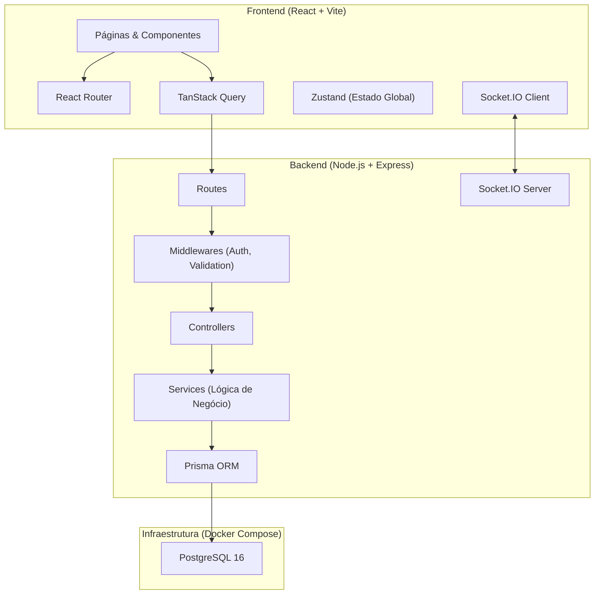
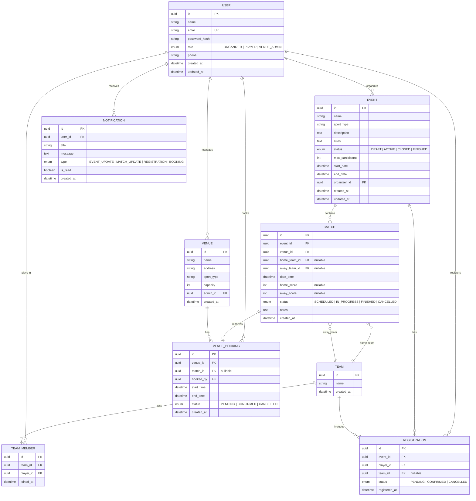

# SportHub - Plano de Implementação (v2)

Plataforma web de gestão integrada de eventos esportivos amadores (focado em **futsal**), conectando **Organizadores**, **Jogadores** e **Administradores de Locais**.

---

## Decisões Confirmadas pelo Usuário

| Decisão | Resposta |
|---------|----------|
| Backend | JavaScript / Node.js + Express |
| Autenticação | **Session-based** (`express-session` + PostgreSQL store) |
| Esporte inicial | Futsal (5 jogadores por time) |
| Notificações | Em tempo real via **WebSocket** (Socket.IO) |
| Admin de Local | Tipo de usuário **separado** |
| Super-admin | **Não** necessário |
| Commits | **Conventional Commits** |
| Landing Page | **Não** incluída (foco nas funcionalidades) |
| Docker | **Docker Compose** para o backend |
| Modelo Team/Match | `home_team_id` e `away_team_id` no Match (flexibilidade para times fixos) |
| Redis | **Não** incluído na v1 |

---

## Arquitetura Geral



### Stack Tecnológica

| Camada | Tecnologia | Justificativa |
|--------|-----------|---------------|
| **Frontend** | React 19 + Vite + TypeScript | Performance, DX moderno, tipagem forte |
| **Roteamento** | React Router v7 | SPA com roteamento declarativo |
| **Estado Global** | Zustand | Leve, simples, sem boilerplate |
| **Data Fetching** | TanStack Query (React Query) | Cache, sync, refetch automático |
| **Validação** | Zod | Validação com inferência de tipos (client + server) |
| **Backend** | Node.js + Express + TypeScript | Requisito NF001 |
| **Autenticação** | `express-session` + `connect-pg-simple` + `bcrypt` | Session-based, simples, segura |
| **WebSocket** | Socket.IO | Notificações em tempo real |
| **ORM** | Prisma | Schema-first, type-safe, ótimo DX |
| **Banco de Dados** | PostgreSQL 16 | Requisito do projeto |
| **Containerização** | Docker Compose | PostgreSQL + ambiente de dev padronizado |
| **Segurança** | Helmet, CORS, Rate Limiting | Boas práticas |
| **Testes** | Vitest (front) + Jest (back) | Cobertura end-to-end |

### Por que Session ao invés de JWT?

| Aspecto | Session | JWT |
|---------|---------|-----|
| **Complexidade** | Simples (cookie automático) | Complexa (refresh tokens, storage) |
| **Revogação** | Trivial (deletar da tabela) | Difícil (precisa de blacklist) |
| **Segurança** | `httpOnly` cookie por padrão | Risco de XSS se armazenado no localStorage |
| **Implementação** | ~30 linhas de config | ~100+ linhas (access + refresh + middleware) |
| **Ideal para** | Projetos acadêmicos, SPAs same-origin | Microserviços, APIs públicas |

A session é armazenada na tabela `session` do PostgreSQL (criada automaticamente pelo `connect-pg-simple`), eliminando a necessidade de Redis.

---

## Estrutura do Projeto (Monorepo Simplificado)

```
sporthub/
├── client/                          # Frontend React + Vite
│   ├── public/
│   ├── src/
│   │   ├── assets/                  # Imagens, ícones, fontes
│   │   ├── components/              # Componentes reutilizáveis
│   │   │   ├── ui/                  # Button, Input, Card, Modal...
│   │   │   ├── layout/              # Header, Sidebar, Footer
│   │   │   └── shared/              # Componentes compartilhados
│   │   ├── features/                # Módulos por funcionalidade
│   │   │   ├── auth/                # Login, Registro, contexto auth
│   │   │   ├── events/              # Listagem, criação, detalhe de eventos
│   │   │   ├── matches/             # Partidas, equipes
│   │   │   ├── registrations/       # Inscrições
│   │   │   ├── venues/              # Locais e reservas
│   │   │   └── notifications/       # Central de notificações (Socket.IO)
│   │   ├── hooks/                   # Custom hooks
│   │   ├── lib/                     # Utilitários, API client (axios)
│   │   ├── store/                   # Zustand stores
│   │   ├── styles/                  # CSS global, design tokens
│   │   ├── types/                   # Tipos TypeScript compartilhados
│   │   ├── App.tsx
│   │   ├── Router.tsx
│   │   └── main.tsx
│   ├── index.html
│   ├── vite.config.ts
│   ├── tsconfig.json
│   └── package.json
│
├── server/                          # Backend Node.js + Express
│   ├── prisma/
│   │   ├── schema.prisma            # Schema do banco
│   │   ├── migrations/              # Migrações
│   │   └── seed.ts                  # Dados iniciais
│   ├── src/
│   │   ├── config/                  # DB, env, session, socket
│   │   ├── controllers/             # Request handlers
│   │   ├── middlewares/             # Auth (session), validation, error
│   │   ├── routes/                  # Definições de rotas
│   │   ├── services/                # Lógica de negócio
│   │   ├── socket/                  # Socket.IO handlers
│   │   ├── utils/                   # Helpers
│   │   ├── types/                   # Tipos TypeScript
│   │   └── app.ts                   # Express + Socket.IO setup
│   ├── Dockerfile                   # Dockerfile do server (dev)
│   ├── tsconfig.json
│   └── package.json
│
├── docker-compose.yml               # PostgreSQL + Server (dev)
├── .env.example                     # Template de variáveis de ambiente
├── .gitignore
├── README.md
└── package.json                     # Scripts raiz (dev, build)
```

---

## Docker Compose (Desenvolvimento)

```yaml
# docker-compose.yml
services:
  postgres:
    image: postgres:16-alpine
    ports:
      - "5432:5432"
    environment:
      POSTGRES_USER: sporthub
      POSTGRES_PASSWORD: sporthub_dev
      POSTGRES_DB: sporthub_db
    volumes:
      - pgdata:/var/lib/postgresql/data

volumes:
  pgdata:
```

> [!NOTE]
> O Docker Compose é utilizado para o **PostgreSQL em desenvolvimento**. O servidor Node.js roda localmente com `tsx` para hot-reload. Em produção, pode-se adicionar o server ao compose.

---

## Modelagem do Banco de Dados



### Mudança Estrutural: Team ↔ Match

> [!IMPORTANT]
> **Inversão da relação Team/Match conforme solicitado.**
> - `Match` agora possui `home_team_id` e `away_team_id` (ambos nullable)
> - `Team` é uma entidade independente (não pertence a um match)
> - `TeamMember` é a tabela de junção entre Team e User (jogadores)
> - Isso permite **times fixos** que participam de múltiplas partidas e eventos no futuro
> - Para futsal: cada time tem até 5 jogadores titulares

### Tabelas Principais

| Tabela | Descrição |
|--------|-----------|
| `User` | Usuários com roles: ORGANIZER, PLAYER, VENUE_ADMIN |
| `Team` | Equipes independentes (reutilizáveis entre partidas) |
| `TeamMember` | Jogadores que compõem cada equipe |
| `Event` | Eventos esportivos de futsal |
| `Match` | Partidas com referência a home_team e away_team |
| `Registration` | Inscrições de jogadores em eventos |
| `Venue` | Locais esportivos (quadras) |
| `VenueBooking` | Reservas de locais para partidas |
| `Notification` | Notificações em tempo real para usuários |

---

## Módulos Funcionais

### 1. Autenticação & Autorização (Session-based)

- **Registro** com nome, email, senha e seleção de role
- **Login** com `express-session` (cookie `httpOnly`, `secure` em prod)
- **Session store** no PostgreSQL via `connect-pg-simple`
- **RBAC Middleware**: roles `ORGANIZER`, `PLAYER`, `VENUE_ADMIN`
- **Hashing** de senhas com `bcrypt` (salt rounds = 12)
- **Logout** destrói a session no server

**Configuração da Session:**
```typescript
// Exemplo simplificado
app.use(session({
  store: new PgSession({ pool, tableName: 'session' }),
  secret: process.env.SESSION_SECRET,
  resave: false,
  saveUninitialized: false,
  cookie: {
    maxAge: 7 * 24 * 60 * 60 * 1000, // 7 dias
    httpOnly: true,
    secure: process.env.NODE_ENV === 'production',
    sameSite: 'lax',
  },
}));
```

**Rotas da API:**
```
POST   /api/auth/register
POST   /api/auth/login
POST   /api/auth/logout
GET    /api/auth/me
```

---

### 2. Módulo do Organizador — Gestão de Eventos (RF001, RF002)

#### [RF001] Cadastrar Evento e Partidas
- CRUD completo de eventos (futsal)
- Criação de partidas vinculadas ao evento com data, hora e local sugerido
- Validação de conflito de horário no local sugerido
- Status do evento: DRAFT → ACTIVE → CLOSED → FINISHED

#### [RF002] Gerenciar Inscrições e Equipes
- Visualizar lista centralizada de inscritos
- **Receber notificação em tempo real** (via Socket.IO) quando um jogador se inscreve, para revisar
- Aprovar/rejeitar inscrições (com notificação ao jogador)
- Criar equipes e alocar jogadores (drag & drop no frontend)
- Atribuir equipes como `home_team` ou `away_team` nas partidas

**Rotas da API:**
```
GET    /api/events                     # Listar eventos (filtros)
POST   /api/events                     # Criar evento
GET    /api/events/:id                 # Detalhe do evento
PUT    /api/events/:id                 # Atualizar evento
DELETE /api/events/:id                 # Excluir evento

POST   /api/events/:id/matches         # Criar partida
PUT    /api/matches/:id                # Atualizar partida (times, score)
DELETE /api/matches/:id                # Excluir partida

GET    /api/events/:id/registrations   # Listar inscritos
PUT    /api/registrations/:id/status   # Aprovar/rejeitar inscrição

POST   /api/teams                      # Criar equipe
PUT    /api/teams/:id                  # Atualizar equipe
POST   /api/teams/:id/members          # Adicionar jogador à equipe
DELETE /api/teams/:id/members/:userId  # Remover jogador da equipe
```

---

### 3. Módulo do Jogador — Participação (RF001, RF002)

#### [RF001] Inscrever-se em Evento
- Listagem de eventos ativos com filtros (data, local)
- Botão de inscrição com verificação de vagas
- Cancelamento de inscrição
- **Notificação enviada ao Organizador** para revisão da inscrição

#### [RF002] Visualizar Detalhes e Notificações
- Painel do jogador com eventos inscritos
- Detalhes das partidas (local, data, hora, equipe)
- **Central de notificações em tempo real** (Socket.IO) com alertas de atualização

**Rotas da API:**
```
GET    /api/events/available           # Eventos disponíveis para inscrição
POST   /api/events/:id/register        # Inscrever-se
DELETE /api/events/:id/register        # Cancelar inscrição
GET    /api/player/dashboard           # Painel do jogador
GET    /api/player/matches             # Minhas partidas
GET    /api/notifications              # Notificações do usuário
PUT    /api/notifications/:id/read     # Marcar como lida
PUT    /api/notifications/read-all     # Marcar todas como lidas
```

---

### 4. Módulo Admin de Local — Reservas

- CRUD de locais esportivos (quadras de futsal)
- Calendário visual de reservas
- Aprovação/rejeição de solicitações de reserva (com notificação)
- Detecção automática de conflitos de horário

**Rotas da API:**
```
GET    /api/venues                     # Listar locais
POST   /api/venues                     # Cadastrar local
GET    /api/venues/:id                 # Detalhe do local
PUT    /api/venues/:id                 # Atualizar local
GET    /api/venues/:id/bookings        # Agenda de reservas
POST   /api/venues/:id/bookings        # Solicitar reserva
PUT    /api/bookings/:id/status        # Aprovar/rejeitar reserva
```

---

### 5. Notificações em Tempo Real (Socket.IO)

O sistema de notificações utiliza Socket.IO para entrega em tempo real:

**Eventos emitidos pelo servidor:**
| Evento Socket | Destinatário | Trigger |
|--------------|-------------|---------|
| `notification:new` | Organizador | Jogador se inscreve em seu evento |
| `notification:new` | Jogador | Organizador aprova/rejeita inscrição |
| `notification:new` | Jogador | Partida é atualizada (data/hora/local) |
| `notification:new` | Jogador | Jogador é alocado a uma equipe |
| `notification:new` | Admin Local | Nova solicitação de reserva |
| `notification:new` | Organizador | Reserva aprovada/rejeitada |

**Fluxo:**
1. Usuário faz login → client conecta ao Socket.IO com session cookie
2. Server autentica a conexão via session middleware compartilhado
3. Server emite eventos para rooms específicas (`user:{userId}`)
4. Client exibe badge de notificação + toast em tempo real

---

## Design System & UI

### Princípios de Design
- **Dark mode** como padrão com opção de light mode
- **Glassmorphism** em cards e modais
- **Bento grid layout** para dashboards
- **Micro-animações** com Framer Motion
- **Tipografia moderna**: Inter (Google Fonts)
- **Design responsivo** (mobile-first)

### Paleta de Cores (Dark Mode)

| Token | Valor | Uso |
|-------|-------|-----|
| `--bg-primary` | `hsl(225, 25%, 8%)` | Fundo principal |
| `--bg-secondary` | `hsl(225, 20%, 12%)` | Cards, painéis |
| `--bg-tertiary` | `hsl(225, 18%, 16%)` | Inputs, hovers |
| `--accent-primary` | `hsl(145, 65%, 45%)` | Verde esportivo — CTAs |
| `--accent-secondary` | `hsl(200, 80%, 55%)` | Azul — links, info |
| `--accent-warning` | `hsl(35, 90%, 55%)` | Laranja — avisos |
| `--accent-danger` | `hsl(0, 70%, 55%)` | Vermelho — erros, cancelar |
| `--text-primary` | `hsl(0, 0%, 95%)` | Texto principal |
| `--text-secondary` | `hsl(0, 0%, 65%)` | Texto secundário |
| `--glass-bg` | `rgba(255,255,255,0.05)` | Glassmorphism background |
| `--glass-border` | `rgba(255,255,255,0.1)` | Glassmorphism border |

### Páginas Principais

1. **Login / Registro** — Formulários com validação visual e seleção de role
2. **Dashboard do Organizador** — Bento grid com eventos, partidas, inscrições pendentes
3. **Dashboard do Jogador** — Eventos inscritos, próximas partidas, notificações
4. **Dashboard do Admin de Local** — Calendário de reservas, locais
5. **Listagem de Eventos** — Cards com filtros e busca
6. **Detalhe do Evento** — Info completa, partidas, inscrição
7. **Gestão de Equipes** — Interface drag & drop para alocar jogadores (até 5 por time)
8. **Perfil do Usuário** — Dados pessoais e configurações
9. **Central de Notificações** — Lista de notificações com status lida/não lida

---

## Fases de Desenvolvimento

### Fase 1 — Fundação (Sprint 1) ✅ CONCLUÍDA
- [x] Inicializar monorepo com `client/` e `server/`
- [x] Configurar Docker Compose (PostgreSQL)
- [x] Configurar Vite + React + TypeScript no client
- [x] Configurar Express + TypeScript no server
- [x] Configurar Prisma + PostgreSQL
- [x] Definir schema do banco (com Team/Match invertido + TeamMember)
- [x] Criar seed com dados iniciais (usuários de teste, quadras, eventos)
- [x] Design system (CSS global, tokens, componentes base: Button, Input)
- [x] Configurar Git + `.gitignore`
- [x] Setup do Conventional Commits (commitlint + husky)

> [!NOTE]
> **Pendências da Fase 1:**
> - Rodar `docker compose up -d` para subir o PostgreSQL
> - Rodar `npx prisma migrate dev` para criar as tabelas
> - Rodar `npx prisma db seed` para popular dados iniciais
> - Criar o README.md do projeto

### Fase 2 — Autenticação & Layout (Sprint 2) ✅ CONCLUÍDA
- [x] Implementar registro e login no backend (session + bcrypt)
- [x] Configurar `express-session` com `connect-pg-simple`
- [x] Middleware de autenticação e autorização (RBAC)
- [x] Telas de login e registro no frontend
- [x] Layout base (Header, Sidebar, proteção de rotas)
- [x] Contexto de autenticação (Zustand + React Query)

### Fase 3 — Módulo do Organizador (Sprint 3) ✅ CONCLUÍDA
- [x] CRUD de eventos (backend + frontend completos)
- [x] Criação de partidas dentro de eventos (Interface e lógica prontas)
- [x] Gestão de inscrições (Aprovação/Rejeição funcional com notificações)
- [x] Notificação ao organizador quando jogador se inscreve (Lógica implementada)
- [x] Criação de equipes e alocação de jogadores (Interface de gestão de times pronta)
- [x] Validação de conflitos de horário (Implementada no backend)

### Fase 4 — Módulo do Jogador & Notificações (Sprint 4)
- [ ] Listagem de eventos disponíveis com filtros
- [ ] Inscrição/cancelamento em eventos
- [ ] Dashboard do jogador
- [ ] Setup do Socket.IO (server + client)
- [ ] Sistema de notificações em tempo real
- [ ] Central de notificações
- [ ] Detalhes das partidas e equipes

### Fase 5 — Módulo de Locais & Polish (Sprint 5)
- [ ] CRUD de locais esportivos (quadras de futsal)
- [ ] Sistema de reservas com detecção de conflitos
- [ ] Calendário visual de reservas
- [ ] Responsividade e ajustes finais de UI
- [ ] Testes automatizados
- [ ] Documentação final

---

## Alterações Propostas

### Inicialização do Projeto

#### [NEW] `sporthub/package.json`
Package.json raiz com scripts para rodar client e server simultaneamente via `concurrently`.

#### [NEW] `sporthub/docker-compose.yml`
Docker Compose com PostgreSQL 16 Alpine, volume persistente, porta 5432.

#### [NEW] `sporthub/client/` (Vite + React + TypeScript)
Projeto React inicializado com `create-vite` template `react-ts`.

#### [NEW] `sporthub/server/` (Express + TypeScript)
Projeto Node.js com Express, configurado com TypeScript, Prisma, Socket.IO e estrutura de pastas (controllers, services, middlewares, routes, socket).

#### [NEW] `sporthub/server/prisma/schema.prisma`
Schema Prisma com modelos: User, Team, TeamMember, Event, Match (com home/away team), Registration, Venue, VenueBooking, Notification.

#### [NEW] `sporthub/server/Dockerfile`
Dockerfile para desenvolvimento do servidor Node.js.

#### [NEW] `sporthub/client/src/styles/index.css`
Design system completo com CSS custom properties, dark mode, glassmorphism, tipografia Inter.

#### [NEW] `sporthub/client/src/components/ui/`
Componentes base reutilizáveis: Button, Input, Card, Modal, Badge, Avatar.

#### [NEW] `sporthub/.gitignore`
Ignorar node_modules, .env, dist, .prisma, pgdata, etc.

#### [NEW] `sporthub/.env.example`
Template com variáveis: DATABASE_URL, SESSION_SECRET, PORT, CLIENT_URL.

#### [NEW] `sporthub/README.md`
Documentação do projeto com instruções de setup (Docker Compose), arquitetura e tecnologias.

---

## Plano de Verificação

### Testes Automatizados
- **Backend**: Testes unitários dos services com Jest
- **Backend**: Testes de integração das rotas da API com Supertest
- **Frontend**: Testes de componentes com Vitest + Testing Library
- **Comando**: `npm run test` (raiz executa ambos)

### Verificação Manual
- Testar fluxo completo: registro → login → criar evento → inscrever jogador → notificação ao organizador → aprovar inscrição
- Verificar RBAC (jogador não pode criar evento, organizador não pode gerenciar locais)
- Testar conflitos de horário em reservas
- Testar notificações em tempo real (abrir 2 abas com usuários diferentes)
- Verificar responsividade em mobile/tablet/desktop
- Testar no navegador com DevTools para performance (< 3s conforme NF001-Desempenho)
- Verificar Docker Compose: `docker compose up` → PostgreSQL funcional → migrations rodando
